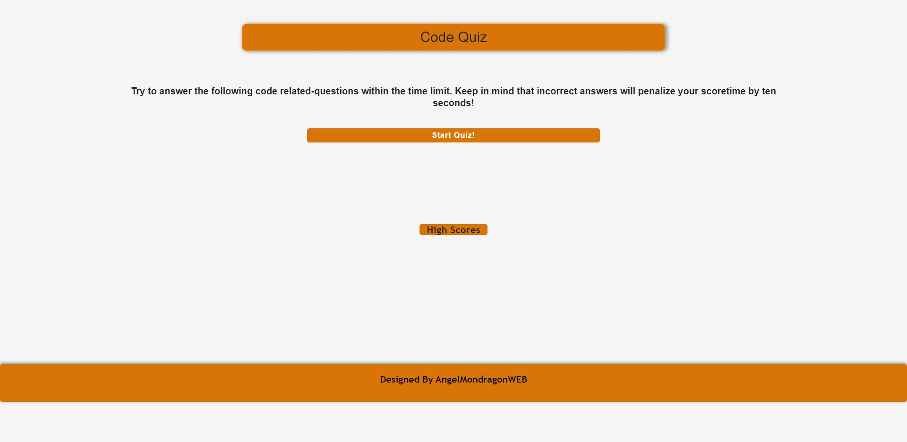
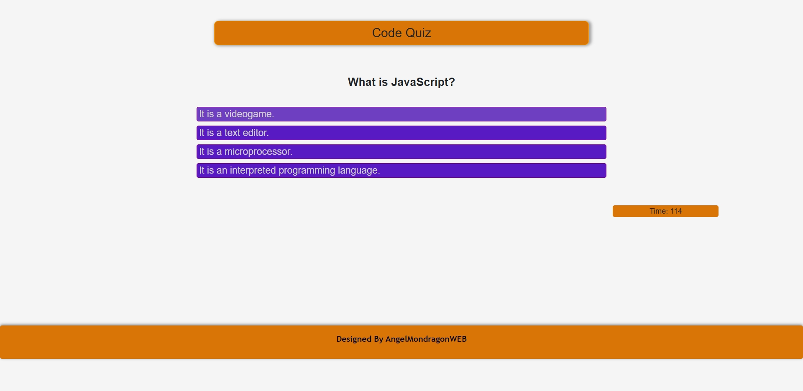

# Code-Quiz

# This proyect is a code-quiz game about some of the fundamentals of JavaScript. I have enjoyed pretty much doing it, it was a really challenging job, and probably can be improved but I did my best.

# ABOUT THE GAME

* We have a starter button to start the game. Once click on it, it will display the first question and a timer will start to count down from 80 second, every question will be display with the different options, every question just have a correct answer and every time the answer is incorrect it will take off 10 seconds from the timer.

* At the and of the game you will see your score and will be able to save your score with your initials.

# TECHNOLOGIES I USED

* For this proyect I used HTML, CSS, BOOTSTRAP, VANILLA JAVASCRIPT AND jQUERY.

* I used CSS for the desing and bootstrap just for the responsive.

* For select my html objects from JavaScript I used jQuery to keep my code a little bit more clean.

* Initial view

* View with the first question displayed
